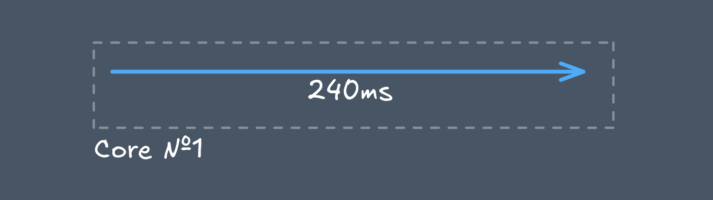
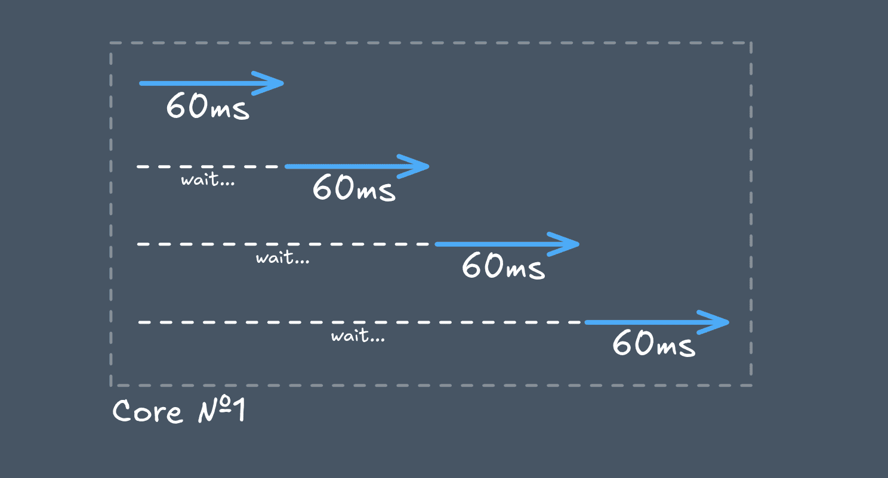
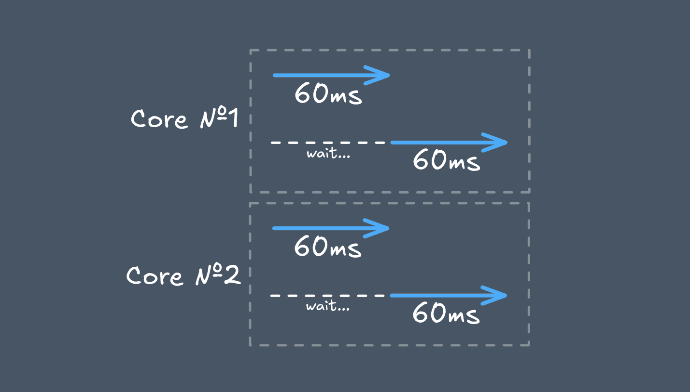
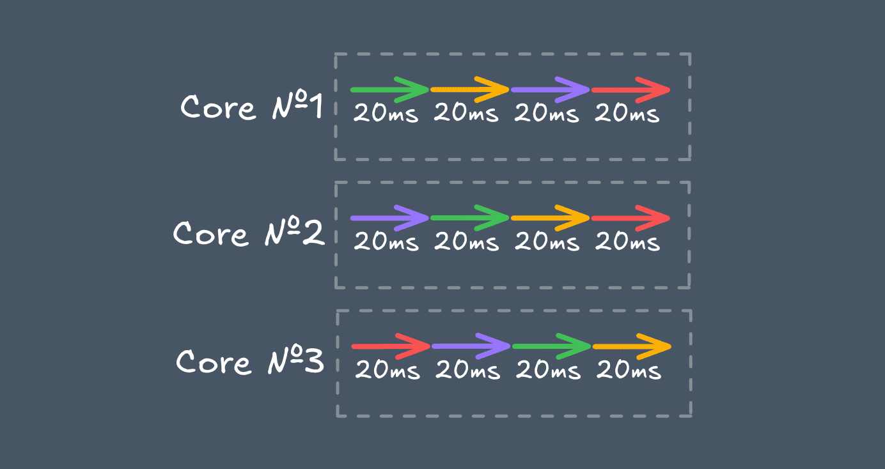
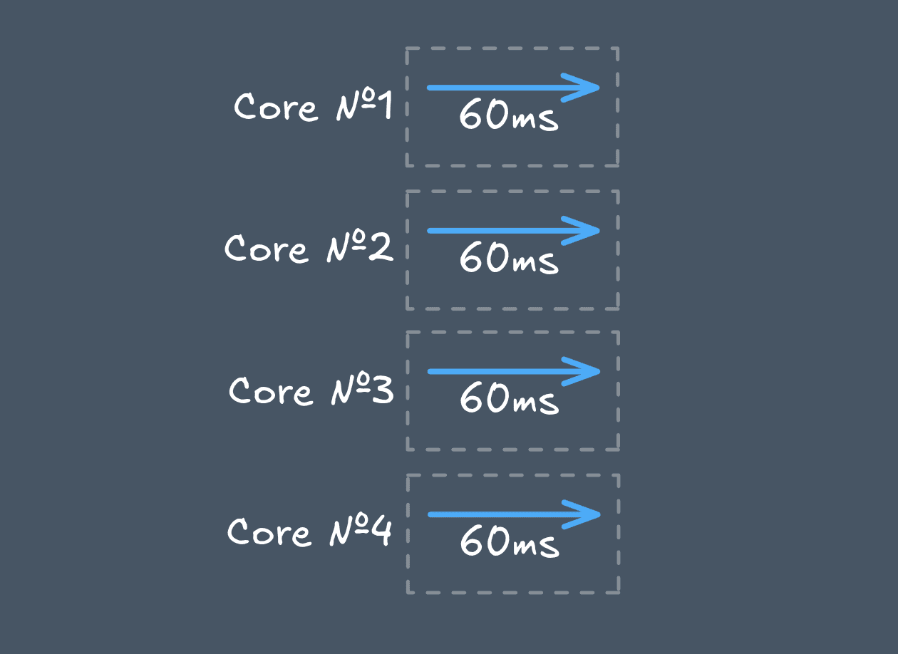
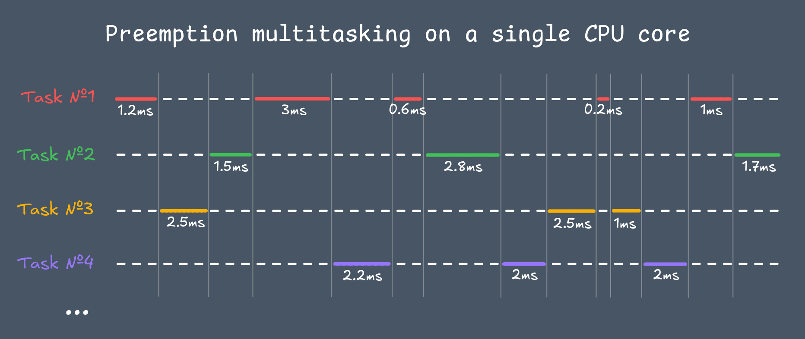

+++
title = "Concurrency Illustrated"
date = 2025-12-27
[extra]
toc = true
go_to_top = true
+++

Concurrency is the nuanced middle ground between two clear extremes: sequential execution, where tasks run one after another, and parallel execution, where tasks run simultaneously. This intermediate position — where tasks overlap in time but may not truly execute at the same instant — makes concurrency inherently less intuitive and more challenging to grasp.

Let's try to fix this with a simple program in Go, in which we define a CPU-bound task to load the processor for a certain amount of time:

```go
package main

import (
  "fmt"
  "runtime"
  "time"
)

func main() {
  start := time.Now()
  heavyTask(1_000_000_000)
  took := time.Since(start).Milliseconds()

  fmt.Printf("Took: %d ms\n", took)
}

func heavyTask(iterations int) int {
  sum := 0
  for i := range iterations {
    sum += i % 7
  }
  return sum
}
```

```sh
$ go run main.go
Took: 240 ms
```



This is a simple program that utilize only 1 CPU core, nothing unusual.

If we divide this program into 4 equal parts and run them one by one, nothing changes:

```go
func main() {
  start := time.Now()
  heavyTask(250_000_000)
  heavyTask(250_000_000)
  heavyTask(250_000_000)
  heavyTask(250_000_000)
  took := time.Since(start).Milliseconds()

  fmt.Printf("Took: %d ms\n", took)
}
```

```sh
$ go run main.go
Took: 240 ms
```


We still utilize a single processor core without employing any mechanisms to accelerate the program's performance. We simply cut the cake, leaving each piece in its place.

Now let's run each part of the task in a separate goroutine (lightweight thread), but let our program process only one at a time:

```go
func main() {
  runtime.GOMAXPROCS(1) // Max number of goroutines to run at once
  start := time.Now()
  var wg sync.WaitGroup

  for _ = range 4 {
    wg.Go(func() {
      heavyTask(250_000_000)
    })
  }

  wg.Wait()
  took := time.Since(start).Milliseconds()

  fmt.Printf("Took: %d ms\n", took)
}
```

```sh
$ go run main.go
Took: 240 ms
```

> Also note that `GOMAXPROCS` is not a hard CPU limit - it only controls how many goroutines can execute in parallel within the Go runtime. The OS can still schedule threads on any available cores unless you explicitly restrict CPU affinity at the system or container level.



The speed of our program has not changed, since the processor resource is still limited to one core. But now each task of the program runs in a separate goroutine — a lightweight execution unit multiplexed onto OS threads. Each such thread can compete with others for available resources.

Concurrency involves structuring programs in such a way that multiple tasks can be performed independently of each other, competing for available resources.

Let's try to gradually increase the number of cores available to the program:

```go
runtime.GOMAXPROCS(2) // Max number of goroutines to run at once
```

```sh
$ go run main.go
Took: 120 ms
```



```go
runtime.GOMAXPROCS(3)
```

```sh
$ go run main.go
Took: 80 ms
```

Notice how efficiently the resources are utilized.

> With `GOMAXPROCS=3`, we have one more CPU core compared to previous step. To efficiently utilize all three cores across four goroutines, the Go scheduler preempts long-running tasks and splits the execution of each goroutine into short time slices (quants). As a result, each goroutine still receives a total of 60 ms of pure CPU time - but not continuously - interleaved with others. Thanks to this, all three cores run without idle time.



```go
runtime.GOMAXPROCS(4)
```

```sh
$ go run main.go
Took: 60 ms
```



As you can see, the more resources we have, the faster the program runs due to the concurrent work of goroutines.

My system has enough CPU cores to run each task (in this case, there are 4) on a separate core, which ultimately results in a fourfold acceleration of the program. In the last run, we ended up with a special case of concurrency — **parallelism**, where all tasks were performed independently on a separate CPU core, since there were sufficient resources for this.

In general, if you look at the overall operation of a computer, all processes within it compete for resources. A typical PC has an average of 4 to 16 physical CPU cores. But if you look at how many processes are running simultaneously in the system, their number can reach several hundred.

All this works thanks to competitive behavior. And there are two types of it: **cooperative** and **preemptive**.

Historically, Go has mainly used cooperative scheduling, where a single goroutine could take up processor resources for a long time and not share them with anyone else. Since [Go 1.14](https://go.dev/doc/go1.14#runtime), the runtime supports asynchronous preemption, allowing long-running CPU-bound goroutines to be interrupted without explicit yield points, such as mutexes, channels, sleeps, [runtime.Gosched](https://pkg.go.dev/runtime#Gosched) calls, file system and network requests.



Competition at the operating system level is always **preemptive**. In this case, a single process cannot occupy the processor for a long time; instead, the OS gives everyone short time slices to gradually and evenly perform all the necessary tasks from all processes on the computer.
