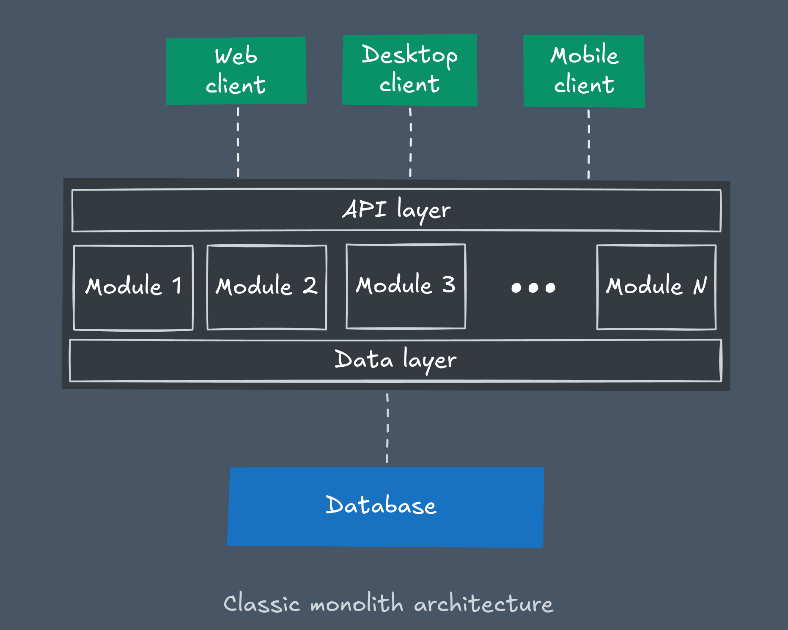
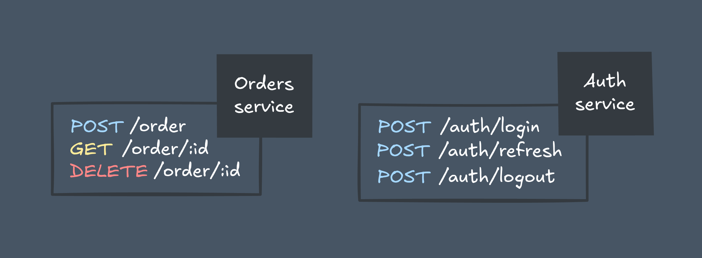
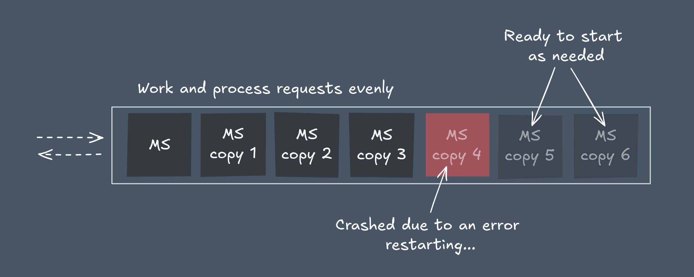
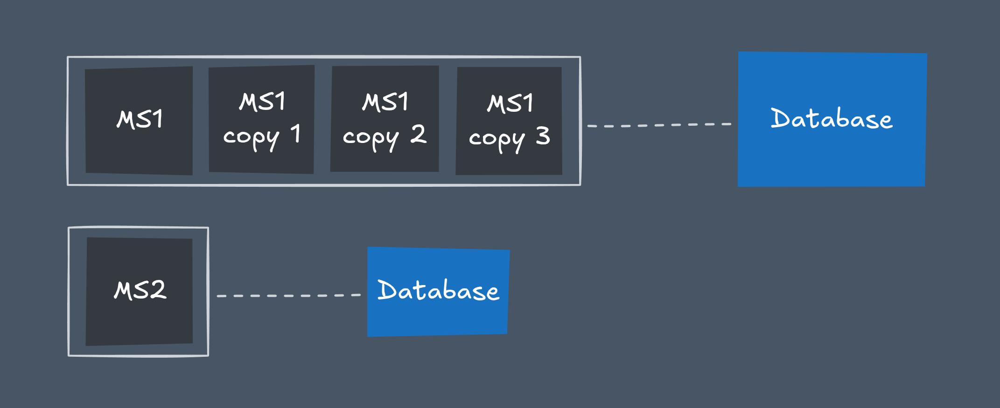
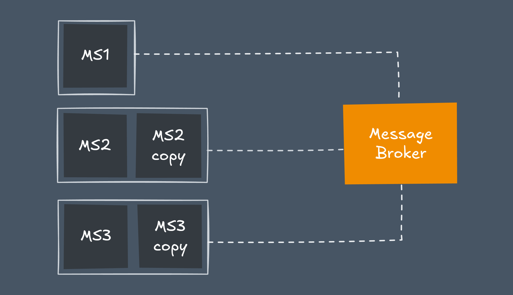
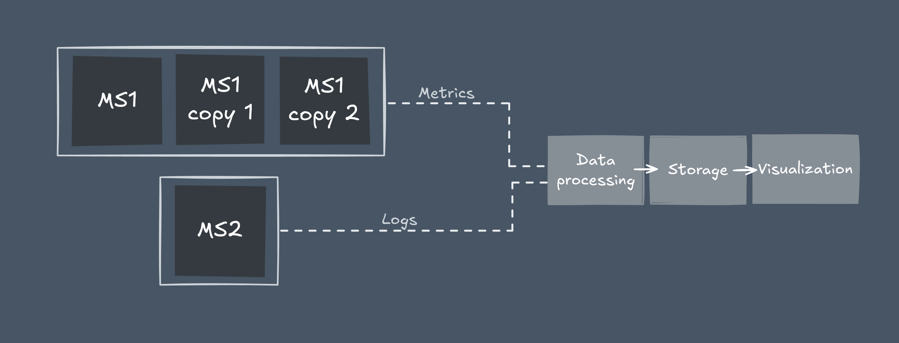
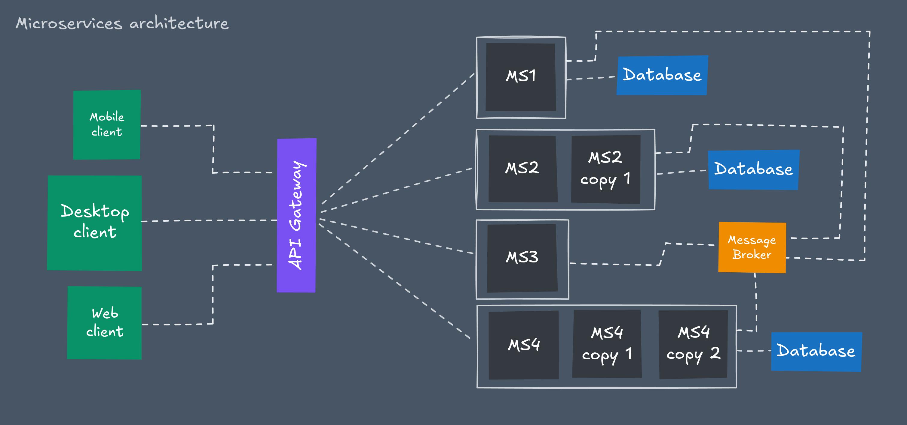

+++
title = "Simple about microservices"
date = 2025-10-26
[extra]
toc = true
go_to_top = true
+++

Recently, I have become quite interested in microservices and architectural approaches for building scalable systems. In this regard, I decided to write a series of articles in which I will thoroughly analyze all the intricacies of such systems as simply and clearly as possible.

## The problem

Back in the early days of web development, [monolithic architecture](https://en.wikipedia.org/wiki/Monolithic_application) wasn’t just popular — it was the default. Developers naturally built all-in-one applications that handled everything from the user interface to database operations. Splitting such a system into multiple services didn’t just seem unnecessary — it sounded like needless complexity.

Why complicate something that already worked just fine?
With small teams and relatively light traffic (at least by today’s standards), monoliths were simple, reliable, and easy to reason about.

But as projects grew, cracks began to show. The once-straightforward monolith turned into a massive, tangled system where even a small change in one module could unexpectedly break something completely unrelated. Scaling a single heavy component meant scaling the entire application. Development slowed down, risks grew, and teams lost the ability to work independently on different parts of the product.

For a long time, there wasn’t really an alternative — the tech just wasn’t there yet. We didn’t have global-scale platforms like Google or Netflix, and most companies didn’t need hundreds of engineers working in parallel.

Then the digital era truly kicked in. Web services exploded in size, teams grew fast, and businesses started demanding faster release cycles. Suddenly, the “all-in-one” approach just couldn’t keep up.

That’s when the industry hit a turning point. The traditional monolithic model had reached its limits — and from that pain point, the concept of [microservices](https://en.wikipedia.org/wiki/Microservices) was born.

## What is microservice

A microservice by itself isn’t exactly a revolutionary idea. At its core, it’s still just an indivisible codebase — developed, built, and deployed as a single unit.

The real innovation comes when you start connecting these isolated services into one loosely coupled, resilient system. For that system to work effectively, each microservice must strictly follow a set of key principles.

### Single Responsibility

Every microservice should have one clear area of responsibility — it solves one specific business problem and doesn’t accumulate unrelated features over time.

If a service handles image compression, it should stay focused on that task — improve compression algorithms, add support for new formats, or fine-tune performance and quality options.

Adding unrelated functionality — like object detection, image generation, or AI effects — breaks the single responsibility principle and turns the service into yet another mini-monolith. Each new business function deserves its own microservice, with its own scope and independent lifecycle.

### Clear, Stable API

To be safely consumed, a microservice must expose a clear, stable, and [versioned](https://semver.org/) [API](https://en.wikipedia.org/wiki/API). Common approaches include [HTTP](https://en.wikipedia.org/wiki/HTTP) ([REST](https://en.wikipedia.org/wiki/REST)), [RPC](https://en.wikipedia.org/wiki/Remote_procedure_call) ([gRPC](https://en.wikipedia.org/wiki/GRPC)), and [GraphQL](https://en.wikipedia.org/wiki/GraphQL).

Changes in functionality should never break existing contracts. You can add new features, but if you need to change or remove something — release a new API version instead. Old versions must remain supported until all clients have migrated, ensuring backward compatibility and overall system stability.

### Horizontally Scalable & Stateless

A true microservice should be [horizontally scalable](<https://en.wikipedia.org/wiki/Scalability#Horizontal_(scale_out)_and_vertical_scaling_(scale_up)>) and [stateless](<https://en.wikipedia.org/wiki/State_(computer_science)>).

That means every instance is fully independent — you can spin up as many copies as needed (independent [deployment](https://en.wikipedia.org/wiki/Software_deployment)).

Since the service doesn’t store any local state (e.g., in process memory), new instances can be freely added or removed to balance the load and improve resilience.

All persistent data and session state should live in external systems — such as [databases](https://en.wikipedia.org/wiki/Database), [caches](<https://en.wikipedia.org/wiki/Cache_(computing)>), or [message brokers](https://en.wikipedia.org/wiki/Message_broker).

### Independent Data Storage

Each microservice owns its data store. It manages its database schema and is responsible for its data’s structure and integrity.

This doesn’t mean every instance gets its own copy of the data. Logical ownership ≠ physical duplication. All replicas of the service share the same underlying dataset to scale correctly.

Database scaling ([replication](<https://en.wikipedia.org/wiki/Replication_(computing)>), [sharding](<https://en.wikipedia.org/wiki/Shard_(database_architecture)>), etc.) is an infrastructure concern — independent from the service instances themselves. The service just knows how to connect to its database and treats it as an external resource.

### Controlled External Communication

A microservice is autonomous — but not isolated. It often needs to talk to other services, and that communication must happen through well-defined interfaces.

In some cases, a simple request-response model (REST, gRPC) is enough. In more complex systems, you might need asynchronous messaging through tools like [RabbitMQ](https://en.wikipedia.org/wiki/RabbitMQ), [Apache Kafka](https://en.wikipedia.org/wiki/Apache_Kafka), or [NATS](https://en.wikipedia.org/wiki/NATS_Messaging).

The latter approach requires thoughtful design to maintain consistency, reliability, and [fault tolerance](https://en.wikipedia.org/wiki/Fault_tolerance) (see [microservice communication patterns](https://microservices.io/patterns)).

That said, a microservice shouldn’t depend on external communication for its core functionality. It should provide standalone value on its own.

If a service exists only to call another one — it’s not a microservice; it’s just an unnecessary middle layer. Or worse — part of a [distributed monolith](https://gist.github.com/StevenACoffman/4685ae6dbc8cacf197f26922055e6ecc).

### Centralized Logging and Metrics

Since each microservice can have multiple instances, manual monitoring isn’t practical.

You need centralized [logging](<https://en.wikipedia.org/wiki/Logging_(computing)>) and [metrics](https://en.wikipedia.org/wiki/Software_metric) platforms — such as [ELK stack](https://en.wikipedia.org/wiki/Elasticsearch#Features), [LGTM stack](https://grafana.com/go/webinar/getting-started-with-grafana-lgtm-stack/), [Graylog](https://github.com/graylog2), or [Prometheus](<https://en.wikipedia.org/wiki/Prometheus_(software)>).

These tools provide a unified view of all instances, helping teams quickly detect errors, identify bottlenecks, and understand the real-time health of the entire system.

## Microservices architecture

Microservices architecture defines how multiple microservices work together as a single, cohesive system.

The real complexity and innovation lie not in the individual services themselves, but in the architecture — the way these independent pieces are organized and communicate.

If a microservice is a building block, then microservices architecture is the blueprint that determines how those blocks fit and interact to form a stable, scalable structure.

While microservices solved many of the fundamental problems of monolithic systems, they also introduced a whole new set of challenges.

The simplicity of a single codebase was replaced by operational complexity — the need to automate deployment for hundreds of independent services, establish reliable inter-service communication, and maintain data consistency across a distributed system.

These challenges forced engineering teams to rethink how software is built and delivered. Out of that shift came [DevOps](https://en.wikipedia.org/wiki/DevOps) practices, bringing automation and structure to modern development: [CI/CD](https://en.wikipedia.org/wiki/CI/CD) pipelines for continuous integration and delivery, [container orchestration](https://www.redhat.com/en/topics/containers/what-is-container-orchestration) with tools like [Kubernetes](https://en.wikipedia.org/wiki/Kubernetes) and specialized infrastructure management systems designed to handle the scale and dynamics of microservice environments.

## Comparasion

To better understand the difference between monoliths and microservices (their pros and cons), we can compare them based on several key characteristics:

| Characteristic               | Description                                                                                                        | Monolith                                                                                                                  | Microservices                                                                                                                                                                                                                                             |
| ---------------------------- | ------------------------------------------------------------------------------------------------------------------ | ------------------------------------------------------------------------------------------------------------------------- | --------------------------------------------------------------------------------------------------------------------------------------------------------------------------------------------------------------------------------------------------------- |
| MVP Development              | Speed and simplicity of building a [minimum viable product](https://en.wikipedia.org/wiki/Minimum_viable_product). | 🟢 **Fast**  Single codebase, simple to develop, test, and deploy.                                                     | 🟡 **Medium**  Overhead of distributed system slows initial speed, but allows focused MVPs per service.                                                                                                                                                |
| Scalability & Distribution   | Ability to scale components independently and distribute across servers.                                           | 🔴 **Hard**  Entire application scaled as a single unit, even if only one module is under load.                        | 🟢 **Excellent**  Individual services can be scaled independently based on their specific demand.                                                                                                                                                      |
| Deployment Independence      | Ability to deploy one part of the system without redeploying everything.                                           | ⚫ **Impossible**  A small change requires rebuilding and redeploying the entire system.                               | 🟢 **Excellent**  Services can be deployed independently, enabling rapid, continuous delivery.                                                                                                                                                         |
| Resilience & Fault Isolation | System's ability to withstand and contain failures.                                                                | 🔴 **Hard**  A bug in one module can bring down the entire application (single point of failure).                      | 🟡 **Medium**  Failures are isolated to a single service. Requires careful design ([circuit breakers](https://en.wikipedia.org/wiki/Circuit_breaker_design_pattern)) to prevent cascading failures.                                                    |
| Data Consistency Model       | How data integrity is maintained across the system.                                                                | 🟢 **Easy**  [ACID](https://en.wikipedia.org/wiki/ACID) Transactions. Single database ensures strong consistency.      | 🔴 **Hard**  Eventual consistency. Each service has its own database. Maintaining consistency requires complex patterns.                                                                                                                               |
| Communication Overhead       | Network and data exchange latency between components.                                                              | 🟢 **Low**  In-memory method calls are fast and reliable.                                                              | 🔴 **High**  Network calls (API, RPC, messaging) are slower, less reliable, and add latency.                                                                                                                                                           |
| Operational Complexity       | Effort required to monitor, log, deploy, and maintain the system.                                                  | 🟢 **Low**  Single codebase to deploy, monitor, and log. Centralized configuration and debugging.                      | 🔴 **High**  Multiple services to deploy, coordinate, monitor, and debug. Requires distributed [tracing](<https://en.wikipedia.org/wiki/Tracing_(software)>), [service discovery](https://en.wikipedia.org/wiki/Service_discovery), and complex CI/CD. |
| Technology Flexibility       | Freedom to use different tech stacks (languages, databases) per component.                                         | ⚫ **Impossible**  Typically locked into a single technology stack for the entire application.                         | 🟢 **Excellent**  Each service can use the technology best suited for its specific job.                                                                                                                                                                |
| Security Exposure            | Surface area for attacks and complexity of securing the system.                                                    | 🟡 **Medium**  Smaller attack surface but a single breach can compromise everything.                                   | 🔴 **Hard**  Larger attack surface (network communication). Requires robust API security, service identity, and [secrets management](https://www.redhat.com/en/topics/devops/what-is-secrets-management).                                              |
| Testing                      | Complexity of writing and executing tests.                                                                         | 🟢 **Easy**  Easier to test end-to-end since all logic runs in one process and environment.                            | 🔴 **Hard**  Requires testing per service + contract testing + network failure simulation + distributed integration testing.                                                                                                                           |
| Evolution (growth)           | Ease of making changes and organizing development teams.                                                           | 🔴 **Hard**  Tight coupling makes changes risky. Teams often work on the same codebase, causing coordination overhead. | 🟢 **Easy**  Teams own their services end-to-end, enabling parallel work and faster evolution.                                                                                                                                                         |
| Cost Efficiency              | Overall development and infrastructure cost at scale.                                                              | 🟢 **Cheap**  Low infrastructure and operational overhead.                                                             | 🟡 **Medium**  Higher infrastructure and DevOps costs, but can be more cost-effective at large scale due to efficient resource usage.                                                                                                                  |

There’s no such thing as a “perfect” architecture. There are only trade-offs that make sense in specific contexts.

If you’re building a startup and speed to market is your top priority, a monolith can be your best friend. It’s simpler, faster to develop, and doesn’t require heavy infrastructure from day one. Yes, it comes with scaling limitations — but at an early stage, that’s rarely your biggest problem.

For large organizations, it’s a completely different story. When you have dozens of teams, millions of users, and a high release cadence, the weaknesses of a monolith start to show. That’s when microservices begin to make sense: they bring team autonomy, flexibility in technology choices, and the ability to scale specific parts of the system independently.

The right choice depends on what you’re willing to trade off and what truly matters to you. Figure out which challenges you can handle effectively — and which ones might be beyond your power.
