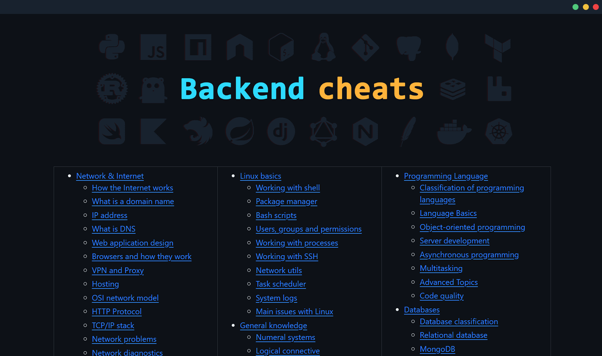

About a year and a half ago, I set out to create a some king of programming overview map focusing on topics and technologies related to server-side development. I sketched out some rough outline and started filling this project with information day by day. 

[Backend cheats on GitHub](https://github.com/cheatsnake/backend-cheats)

I've categorized everything into chapters and topics. Each topic contains a brief squeeze of information, as well as links to resources where you can dive into it in detail. Some of the information was conveniently shown in pictures for better understanding. But I rarely found suitable images on the net (I always wanted to fix something), so I decided to create them from scratch. For this purpose, I even chose a fixed color palette, so that everything would be in the same style.

I started the project in Russian. But later I started to translate it into English (although I still have a poor command of it, so I apologize for the quality of grammar). Later the branch with the English version became the main one. 

For a long time not many people knew about the project. I made several attempts to spread the word about it through Reddit/Discrod communities, but it didn't bring much popularity. Although I didn't have any particular desire to glorify it in any way. It all happened on its own in November 2022. My repository somehow magically started gaining stars and even made it to the main GitHub trends page.

Ultimately I believe the time was not wasted. I have processed a lot of information, learned a lot of new useful information, structured my knowledge and hopefully benefited someone else.