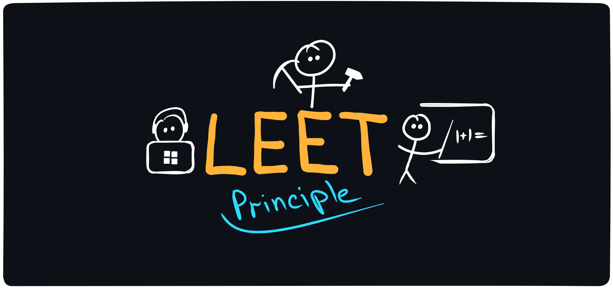

After going through a certain journey of becoming a software developer, I discovered that the most effective way to gain knowledge is by learning through examples.

The answer to why this is the case is quite obvious. When we see a real-life example of new knowledge in action, our brain, in addition to the knowledge itself, remembers a useful [association](<https://en.wikipedia.org/wiki/Associative_memory_(psychology)>) that immediately connects with this knowledge, creating a strong neural link. The closer the example is to real-world tasks, the better it is for both understanding and memorization.

> The more useful examples we find, the more such connections are formed in the brain.

But useful examples won't be enough if you don't apply the knowledge for your own purposes. Only the knowledge that you [apply in practice](<https://en.wikipedia.org/wiki/Practice_(learning_method)>) truly sticks in your memory. Any material that is not supported by practical application will be forgotten in no time. Focus only on the material that you can immediately apply to solve your tasks. Ask yourself: how can this be useful to me right now? Where can I use this?

Many topics contain a vast amount of information. Take programming languages, for example: the documentation for the modern [C++ standard](https://isocpp.org/files/papers/N4860.pdf) spans almost 2,000 pages of technical text. Or English grammar, which is divided into several [levels](https://www.examenglish.com/CEFR/cefr_grammar.htm), each containing dozens of rules, exceptions, and nuances.

[Research](https://en.wikipedia.org/wiki/Pareto_principle) shows that just 20% of this knowledge is enough to cover 80% of practical needs. Learn the most basic constructs of a programming language (variables, loops, conditions, functions, data structures), and you’ll already be able to use it to create your first programs. When you find yourself lacking something - for example, if you want your program to interact with a network - you can simply find a relevant article or video on the topic and, after studying it, apply it to your project.

> Don’t study something if you have no reason or opportunity to use it in practice.

You can go further and bring value not only to yourself but also to others - start creating educational materials. When you’re tasked with [passing knowledge](https://en.wikipedia.org/wiki/Learning_by_teaching) on to someone else, it pushes you to thoroughly work through the material, which helps you structure your own knowledge.

You don’t have to become a school teacher, create online courses, or tutor. Simply start creating "cheat sheets" for yourself and share them online. Often, when learning something, you have to use multiple sources: articles, videos, podcasts, etc. Creating a personal knowledge base, for example, in the form of a [Markdown](https://www.markdown-cheatsheet.com/) document, becomes a convenient and clear resource that you can always return to to refresh your knowledge.

Make your learning materials simple — the kind you would have dreamed of finding before starting to study. Be creative: enhance your content with useful illustrations that you can create yourself. Use services like [Excalidraw](https://excalidraw.com), where automatic smoothing is applied to drawn lines. Develop a unique drawing style with your own color palette to make your work recognizable.

> When you start teaching others, you fill in your own gaps.

Just remember the simple formula for highly effective self-learning:

**LE** (Learn by Examples) + **E** (Employ it in practice) + **T** (Teaching others) = **LEET**
